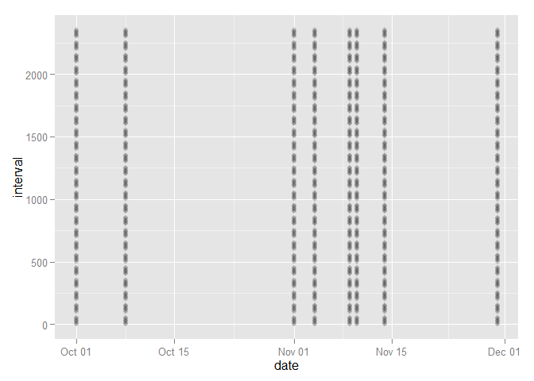

# Reproducible Research: Peer Assessment 1

This report evaluates and summarizes a set of data collected from a personal monitoring device used by an anonymous individual. The device collected data at 5-minute intervals throughout the day for the two-month period October-November 2012. The data is the number of steps taken during each 5-minute interval over the two-month period.

## Loading and preprocessing the data

The first step was to load and preprocess the data. The date column was converted to a date class. The data contained some "NA" values in the steps column.


```r
setwd("C:/Users/Class/datasciencecoursera/RepData_PeerAssessment1")
data <- read.csv("activity/activity.csv", header=TRUE)
data$date <- as.Date(data$date, format="%Y-%m-%d")
library(dplyr)
```

```
## Warning: package 'dplyr' was built under R version 3.1.2
```

```
## 
## Attaching package: 'dplyr'
## 
## The following object is masked from 'package:stats':
## 
##     filter
## 
## The following objects are masked from 'package:base':
## 
##     intersect, setdiff, setequal, union
```

```r
library(ggplot2)
```

```
## Warning: package 'ggplot2' was built under R version 3.1.2
```


## What is mean total number of steps taken per day?

The first task was to calculate the total number of steps taken each day. This was accomplished by using the dplyr package. The "NA" values were ignored for this part of the assignment. A histogram was then drawn to display the frequencies of these daily totals.


```r
dailySum <- subset(data, !is.na(steps)) %>% group_by(date) %>% summarize(sum=sum(steps))
ggplot(dailySum, aes(sum)) + geom_histogram(binwidth=2500) + 
        ggtitle("Total Number of Steps Taken per Day") + 
        labs(x="Steps in a Day")
```

 

The mean and median number of steps were calculated to be 10,766.19 and 10,765 respectively.


```r
meanDailySteps <- mean(dailySum$sum)
meanDailySteps
```

```
## [1] 10766.19
```

```r
medDailySteps <- median(dailySum$sum)
medDailySteps
```

```
## [1] 10765
```


## What is the average daily activity pattern?

Next, an activity pattern was created by calculating  the mean number of steps for each interval across all the days. These were then plotted in a line plot.


```r
grp_by_int <- subset(data, !is.na(steps)) %>% group_by(interval) %>% 
        summarize(intMean=mean(steps))
with(grp_by_int, plot(interval, intMean, type="l", main="Mean Number of Steps in Interval", xlab="5-Minute Interval", ylab="Mean Number of Steps"))
```

 

The interval containing the largest maximum value was calculated to be interval 835.


```r
grp_by_int[which(grp_by_int[,2]==max(grp_by_int[,2])),1]
```

```
## Source: local data frame [1 x 1]
## 
##   interval
## 1      835
```


## Imputing missing values

Then the attention turned to the missing values. The first calculation found that 2304 values were "NA", which was 13% of the total number of values.


```r
sum(is.na(data$steps))
```

```
## [1] 2304
```

```r
sum(is.na(data$steps))/length(data$steps)
```

```
## [1] 0.1311475
```

To identify any kind of pattern in which the values were missing, the date and time interval of the missing values were plotted.

```r
naData <- subset(data, is.na(steps))
ggplot(aes(x=date, y=interval), data=naData) + geom_point(alpha=0.1)
```

 

From the plot, it appears that all the missing values occurred in the same 8 days. Next the data was searched for any valid values recorded on those 8 days, and none were found.


```r
naDays <- unique(naData[,2])
subset(data, date %in% naDays & !is.na(steps))
```

```
## [1] steps    date     interval
## <0 rows> (or 0-length row.names)
```

The day of week for these missing days was calculated to identify any potential patterns, but the days with missing values appeared mixed as far as day of week.


```r
weekdays(unique(naData[,2]))
```

```
## [1] "Monday"    "Monday"    "Thursday"  "Sunday"    "Friday"    "Saturday" 
## [7] "Wednesday" "Friday"
```

Because activity patterns can be similar by day of week, a column with the day of week was added and mean values were calculated for each interval for each day of week.


```r
data$dow <- weekdays(data$date)
data$dow <- factor(data$dow, levels=c("Monday","Tuesday","Wednesday","Thursday","Friday","Saturday","Sunday"))

grp_by_dow <- subset(data, !is.na(steps)) %>% group_by(dow,interval) %>% summarize(mnSteps=mean(steps))
```

These values were used to estimate values for the missing data based on the interval and day of week that was missing and replaced the "NA" values for steps.


```r
for (i in 1:length(naDays)) {
data[data$date==naDays[i],1] <- subset(grp_by_dow, dow==weekdays(naDays[i]))$mnSteps}

dailySum2 <- data %>% group_by(date) %>% summarize(sum=sum(steps))
ggplot(dailySum2, aes(sum)) + geom_histogram(binwidth=2500) + 
        ggtitle("Total Number of Steps Taken per Day") + 
        labs(x="Steps in a Day")
```

 

The mean and median values were then computed using the data with estimated values in place of the missing values. The mean was calculated as 10,821.21, 0.5% higher than before the NA values were replaced. The median was calculated as 11,015, 2.3% higher than before the NA values were replaced.


```r
meanDailySteps2 <- mean(dailySum2$sum)
meanDailySteps2
```

```
## [1] 10821.21
```

```r
(meanDailySteps2 - meanDailySteps)/meanDailySteps
```

```
## [1] 0.005110529
```

```r
medDailySteps2 <- median(dailySum2$sum)
medDailySteps2
```

```
## [1] 11015
```

```r
(medDailySteps2 - medDailySteps)/medDailySteps
```

```
## [1] 0.02322341
```

```r
sum(data$steps == 0)/length(data$steps)
```

```
## [1] 0.6653575
```

A possible reason for the slightly higher median value is that because 67% of the values of steps were recorded as 0, the distributions for steps across days would be skewed to the right. Replacing missing values with means would have caused median values to increase slightly.

## Are there differences in activity patterns between weekdays and weekends?

To investigate differences in activity between weekdays and weekends, a column was added to distinguish this. The data was then summarized for mean values of steps for each interval for weekends and for weekdays. A noticeable difference between the line graphs was a delay in activity on weekends which could be characteristic of sleeping later on weekends. Activity during the weekend is then more consistently higher.


```r
for (i in 1:length(data$dow)) {ifelse(data$dow[i] %in% c("Saturday", "Sunday"), data$wkTm[i] <- "weekend", data$wkTm[i] <- "weekday")}
data$wkTm <- factor(data$wkTm)

grp_by_wkTm <- data %>% group_by(wkTm, interval) %>% summarize(mnSteps=mean(steps))

ggplot(aes(x=interval, y=mnSteps), data=grp_by_wkTm) + geom_line() + facet_wrap(~ wkTm, nrow= 2, ncol=1) + labs(y="Mean Number of Steps")
```

 

